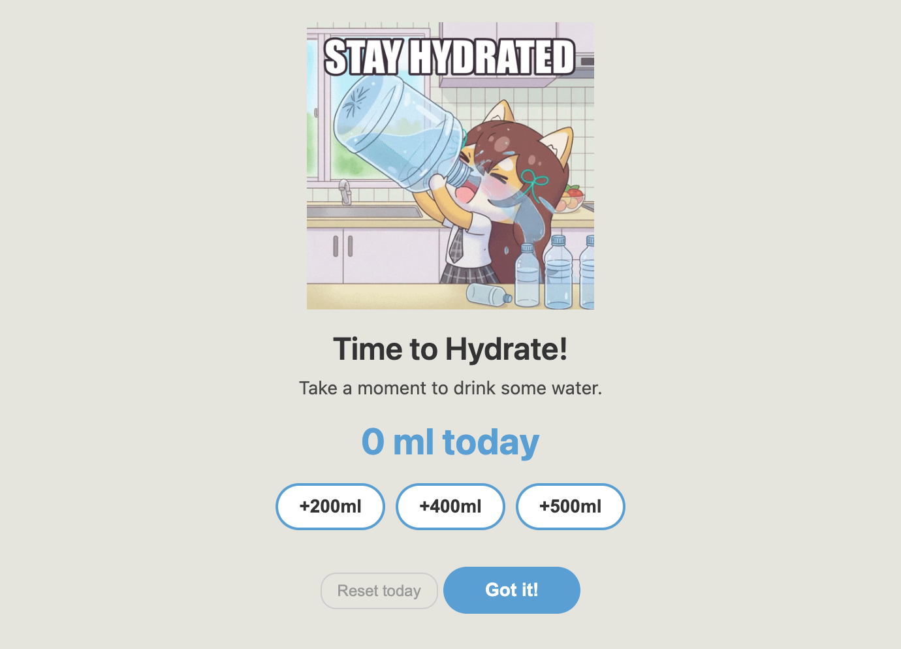

# LetsHydrate

A simple hydration reminder app that pops up every 30 minutes to remind you to drink water.



## Features

- Reminder popup every 30 minutes
- Log water intake with quick buttons (200ml, 400ml, 500ml)
- Track daily total water consumption
- Reset button for accidental clicks
- Always-on-top window so you don't miss reminders
- Data persists across sessions (stored locally)

## Installation

### From Release

Download the latest release from the [Releases](https://github.com/namtx/letshydrate/releases) page.

### From Source

```bash
# Clone the repository
git clone https://github.com/namtx/letshydrate.git
cd letshydrate

# Install dependencies
npm install

# Run the app
npm start

# Build distributable
npm run make
```

## Tech Stack

- Electron
- TypeScript
- Vite

## License

MIT
